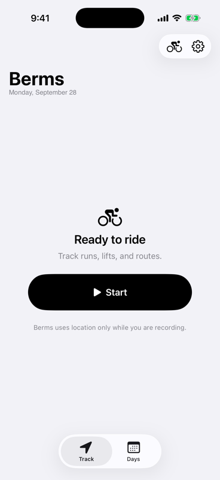
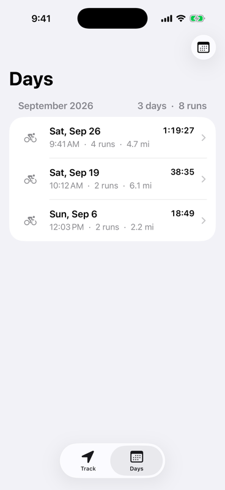
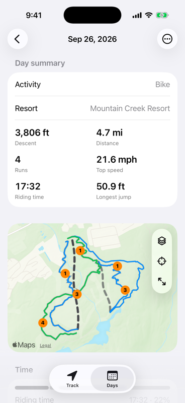
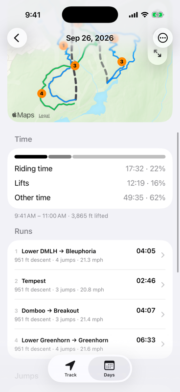
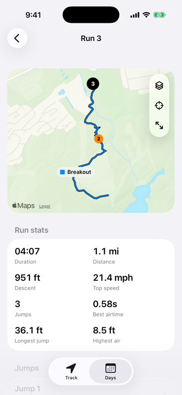
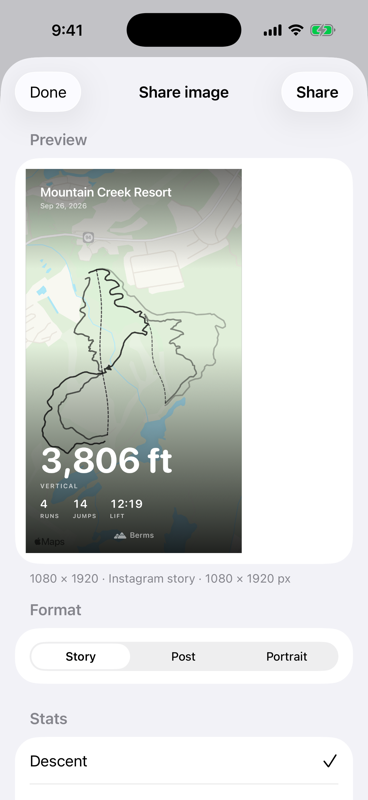

# Berms

A downhill mountain bike tracker built for lift-served bike parks.

The idea is set and forget. Start a session in the morning, put your phone away, and let the app track the rest of the day on its own. It splits lift rides from descents, handles lunch and other breaks, and keeps going without needing to be paused, resumed, or corrected. If you're on the lift, it knows.

Berms is a focused bike park tracker, not a social network. It does one thing and tries to do it well.

<p align="center">
  
  
  
  
  
  
</p>

## Recording

One session covers the whole day. Berms records GPS, barometric altitude, motion activity, and device motion continuously in the background while showing a live map of your run, trail overlays, and a floating stats panel with pause, resume, and finish controls.

From that data it separates lift rides from descents, learns where the lifts are, and recognizes the bottom and top of each lift so a slow section or a mid-run stop doesn't get split incorrectly. It also detects jumps — airtime, distance, height, and drop — and rejects the false positives that come from rough trails.

## Stats

For each day: distance, descent, lift vertical, riding time, lift time, stopped and paused time, top speed, and jump totals. For each run: distance, vertical, duration, top speed, and jumps. You can correct the automatic split with Mark as Lift or split a run at a long stop.

## Trails

At supported parks, Berms matches each run to the trails you actually rode and names the sequence (for example, "Trail A → Trail B"), handling partial runs, direction, and parallel trails. It works at:

- Mountain Creek Resort, Vernon, New Jersey
- Whistler Mountain Bike Park, Whistler, British Columbia

Trail catalogs are bundled, so identification works offline.

## Days

The Days tab keeps a day-by-day archive with a month calendar and jump-to-date. Each day shows a map, time breakdown, run list, jump summary, and a journal field for notes, plus a post-ride recap and shareable image cards sized for posts, stories, and portraits. Days can also be exported as data for backup or for use in BermsStudio.

## Apple Watch

The watch app mirrors the live session: heart rate, top speed, jump airtime, run count, and phone connection status, with pause, resume, finish, and Water Lock controls. Heart rate is collected through a workout session on the watch and is not written to Health as a duplicate workout. A Live Activity on the Lock Screen and Dynamic Island shows the current run and stats, and can pause or resume without opening the app.

## BermsStudio

A separate macOS app for post-ride video. Drop in GoPro clips and a Berms day export, and it matches footage to runs by timestamp, lets you trim clips per run, and exports stitched videos or clips renamed by day, run, and trail. Requires `ffmpeg` and `ffprobe`.

## Privacy

Location, motion, and health data stay on device. There are no accounts, no social features, and no cloud sync.

## Development

SwiftUI and SwiftData, targeting iOS 26 with a watchOS 26 watch app and a macOS 26 Studio app. Requires Xcode.

```sh
./scripts/format.sh   # swift-format with repo config
./scripts/lint.sh     # strict lint, runs in CI
./scripts/test.sh     # XCTest on the iOS Simulator
```

`Settings → About Berms Beta` shows the Git commit, local-change status, and build time the app was built from.

## License

MIT. See [LICENSE](LICENSE).
